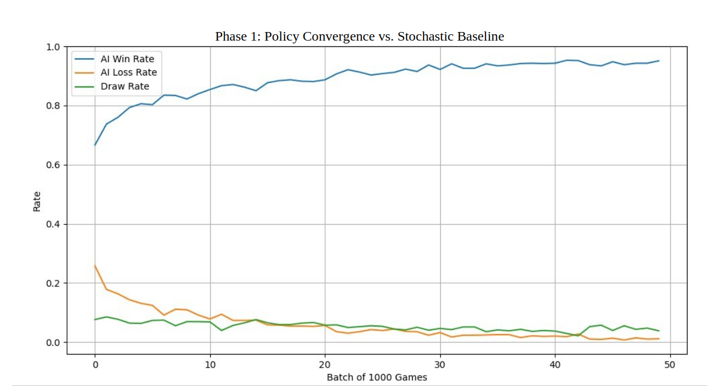
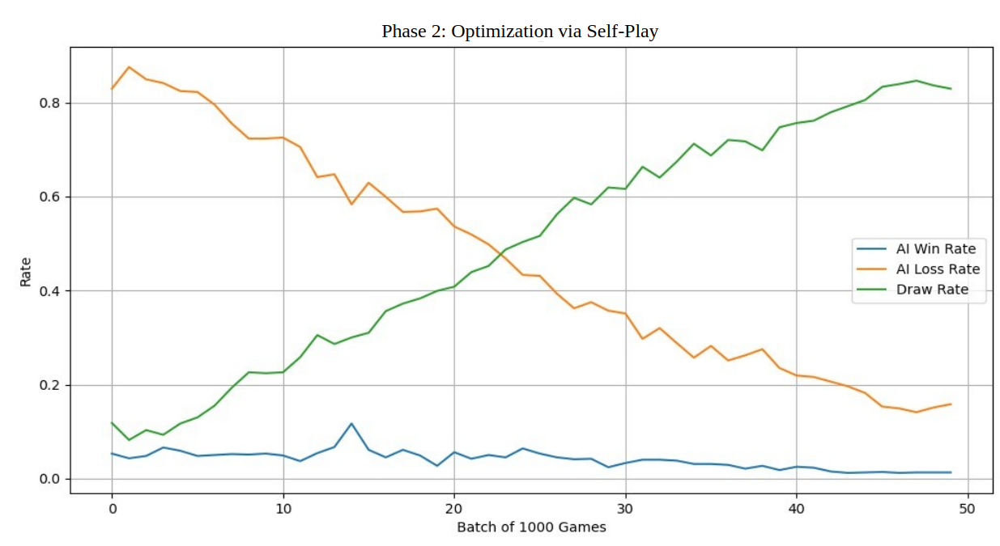
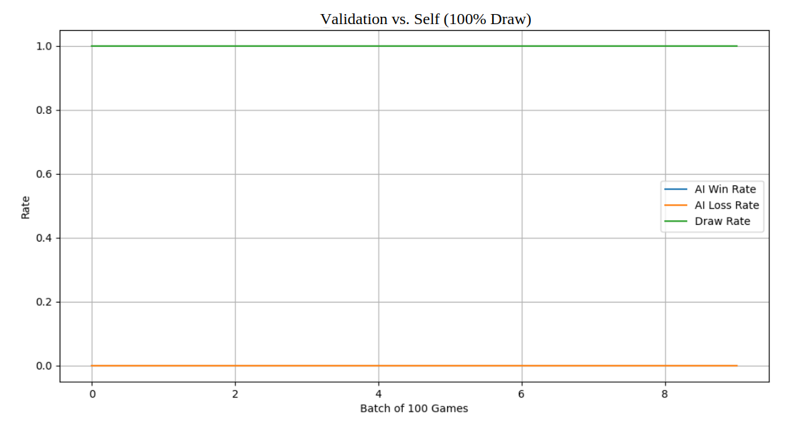

# Reinforcement Learning Tic-Tac-Toe Agent

This repository contains a custom Q-Learning agent built from scratch using Python and PyTorch. The goal of the project was to solve the Tic-Tac-Toe environment by finding the optimal policy (Nash Equilibrium), rather than simply training an agent to beat a random opponent.

## Project Overview

The environment is a standard 3x3 grid implemented using PyTorch tensors. The agent uses a Q-Table to store state-action values and trains using an epsilon-greedy strategy.

While Tic-Tac-Toe is a solved game, it served as an excellent sandbox for me to understand the limitations of basic training loops and the importance of state space optimization.

## The "Lazy Agent" Problem

My initial approach involved training the agent against a bot that made random moves. 

On paper, this looked successful. Within 15,000 iterations, the loss rate dropped significantly. However, when I played against the agent myself, I found it was easy to beat. 


*Above: Training metrics against a random bot. The decreasing loss gave a false sense of mastery.*

The agent had become "lazy." It had learned aggressive strategies that relied on the opponent making mistakes. Because it was never punished for risky play during training, it failed to learn defensive concepts necessary to play against a logical human opponent.

## The Solution: Self-Play

To fix the policy, I switched the training method to **Self-Play**. 

Instead of playing against a random number generator, the agent plays against previous versions of itself. This created an adversarial loop: if the current agent attempted a risky "lazy" move, the opponent (itself) would exploit it. This forced the agent to abandon hope-based strategies in favor of mathematically optimal moves.

I also implemented **Alpha Decay** to stabilize the Q-values. By gradually reducing the learning rate, the agent stops over-adjusting its policy based on outliers late in the training process.

## Optimization: Canonical State Reduction

To make the training computationally efficient, I implemented Canonical State Reduction. 

A standard Tic-Tac-Toe board has a relatively small state space, but many states are geometrically identical. For example, an 'X' in the top-left corner is mathematically the same as an 'X' in the top-right corner if the board is rotated 90 degrees.

I wrote a function to map every board state to its "canonical" form by checking all 8 symmetries (4 rotations and 4 reflections).
This reduced the effective state space by a factor of roughly 8, resulting in a much smaller Q-table and significantly faster convergence.

## Results

After implementing Self-Play and state reduction, the performance metrics shifted drastically.


*Above: Training metrics during self-play. Note how the Draw Rate (Green) converges toward 100%.*

* **Win Rate:** Remained low.
* **Draw Rate:** Skyrocketed to **92%** (converging toward 100%).


*Above: Validation results confirming the Nash Equilibrium.*

In Tic-Tac-Toe, two perfect players will always draw. The high draw rate confirms that the agent successfully solved the game states and reached a Nash Equilibrium.

## How to Run

1. Clone the repository.
2. Ensure you have `torch`, `numpy`, and `matplotlib` installed.
```bash
pip install -r requirements.txt
```
3. To play against the trained agent:
```bash
python play.py
```
If you want to start over by either training against the random_bot:
```bash
python training/agent_bot_train.py
```
or trying out an agent against an agent:
```bash
python training/agent_self_train.py
```
